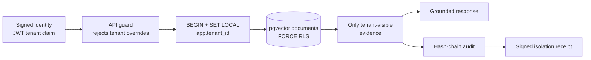

# TenantVault

**A zero-trust, multi-tenant RAG reference project where a model cannot read a
different tenant's vectors—even if application code makes a filtering mistake.**

TenantVault is designed to be a portfolio-grade answer to a real enterprise AI
problem: “How do we give every customer their own AI copilot without creating a
silent data-leak path?” It ships a polished browser demo, a FastAPI service,
PostgreSQL + pgvector schema, hard row-level policies, encrypted sources, and
tests that actively try to breach the tenant fence.

> **Demo:** run the synthetic-data experience locally with the quickstart below
> and click **Present this demo** for the guided walkthrough. Cloud Run and
> Cloud SQL deployment assets remain available under `infra/gcp/`.

## The design in one glance



### What makes it different

- **The tenant identifier is not user input.** It exists only in a verified
  credential claim. A body field is forbidden and `X-Tenant-Id` is rejected.
- **Isolation is a database property.** Each API transaction calls
  `set_config('app.tenant_id', ..., true)`. The pgvector and audit tables have
  `ENABLE` and `FORCE ROW LEVEL SECURITY`; the API role is a non-owner,
  non-superuser without `BYPASSRLS`.
- **Source text has a second fence.** Chunks are encrypted with a tenant-bound
  AES-256-GCM key. A copied ciphertext cannot authenticate under a different
  tenant key.
- **Retrieval is attestable.** Every response carries an *Isolation Receipt*:
  tenant, policy revision, visible corpus size, source hashes, audit-chain head,
  and an HMAC signature. This is a compact, customer-verifiable proof of the
  retrieval boundary rather than an unverifiable “trust us.”
- **It has a built-in red-team demo.** Try the `CONDOR-74-NEVER-LEAK` canary as
  Northstar Health. It belongs to Acme Robotics and never reaches Northstar's
  result set (the reciprocal Acme challenge uses a Northstar canary).

## Run it

For the fastest no-infrastructure demo:

```bash
cd TenantVault
python -m venv .venv && source .venv/bin/activate
pip install -e '.[dev]'
uvicorn tenantvault.api:app --reload --port 8080
```

Then open [http://localhost:8080](http://localhost:8080). The default in-memory
mode keeps the exact same API and security contract for a frictionless demo.

For a full local database-enforced deployment:

```bash
cd TenantVault
docker compose up --build
```

This starts `pgvector/pgvector:pg16`, installs the RLS migration on first boot,
and runs the API as `tenantvault_api`—not as the database owner. Use
`docker compose down -v` only when you intentionally want to delete local demo
data and recreate the schema.

## Deploy the portfolio demo to Google Cloud

TenantVault includes a Cloud Run deployment path backed by Cloud SQL PostgreSQL with pgvector. It keeps the migration role separate from the non-owner runtime role and uses Cloud SQL's managed Unix socket connection.

```bash
chmod +x infra/gcp/deploy.sh infra/gcp/cleanup.sh
PROJECT_ID=your-gcp-project REGION=us-central1 ./infra/gcp/deploy.sh
```

See [the Cloud Run deployment guide](infra/gcp/README.md) for what it creates, security boundaries, and cleanup. These resources are billable; the explicit cleanup script removes them when the demo is no longer needed.

## Give the demo like a product engineer

Click **Present this demo** in the web UI. It places a live marker beside each control and gives an unforced, conversational talk track. The complete 4–5 minute version, including the red-team moment and likely interviewer follow-up answers, is in [the walkthrough script](docs/demo_walkthrough.md).

## Verify the security claim

```bash
cd TenantVault
pytest -q
```

The suite verifies all of the following:

1. Tenant A cannot retrieve Tenant B's exact canary.
2. Tenant B's AES-GCM key cannot decrypt Tenant A's ciphertext.
3. Altering a receipt's tenant claim invalidates its signature.
4. Tenant override attempts are rejected in both headers and JSON bodies.
5. The migration contains mandatory context checks and `FORCE ROW LEVEL SECURITY`.

## API snapshot

The API intentionally has no `tenant_id` query parameter or body field.

```bash
# Get a short-lived local demo token
TOKEN=$(curl -s localhost:8080/api/demo/tokens | jq -r '.northstar.token')

# Ingest: the document is bound to the JWT tenant, not caller input
curl -X POST localhost:8080/v1/documents \
  -H "Authorization: Bearer $TOKEN" -H 'Content-Type: application/json' \
  -d '{"title":"On-call notes","content":"Dr. Rivera owns the Saturday incident review."}'

# Retrieve evidence and its signed receipt
curl -X POST localhost:8080/v1/query \
  -H "Authorization: Bearer $TOKEN" -H 'Content-Type: application/json' \
  -d '{"question":"Who owns the Saturday incident review?"}'
```

## Threat model and honest boundaries

TenantVault protects against cross-tenant reads through the app and data-store
paths demonstrated here, including accidental missing filters and prompt/model
instructions intended to widen retrieval. It does not make a compromised
database superuser, stolen production key material, or a deliberately malicious
control-plane tenant provisioning action harmless. Those need separate KMS,
IAM, network, secret-management, and operational controls. See
[the architecture notes](docs/architecture.md) for the concrete failure-mode
mapping and production checklist.

## Structure

```text
TenantVault/
├── migrations/001_zero_trust.sql   # pgvector schema + RLS policy + least privilege role
├── src/tenantvault/
│   ├── api.py                      # signed identity boundary + HTTP API
│   ├── engine.py                   # retrieval, audit, and signed receipts
│   ├── security.py                 # JWT demo verifier + tenant AES-GCM
│   └── store.py                    # memory demo and PostgreSQL transaction adapter
├── tests/                          # canary, encryption, receipt, and API fence tests
└── web/                            # interactive executive demo
```

This is deliberately small enough to explain in an interview, but every design
choice maps to a production control instead of a slide-deck promise.
