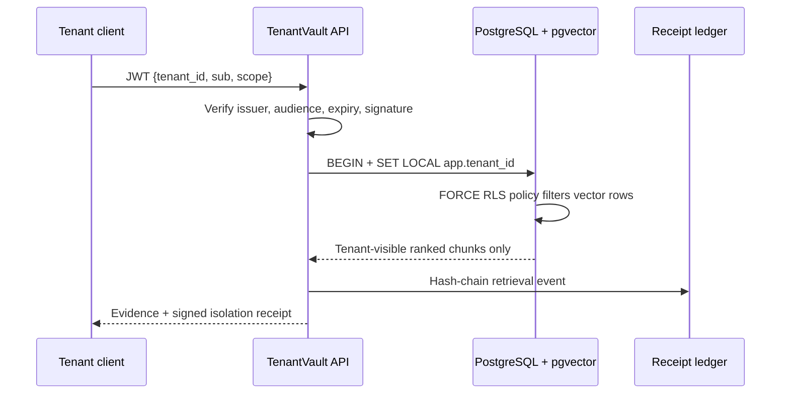

# Why TenantVault is not “tenant_id in a WHERE clause”

The model/embedding layer is not trusted to choose a tenant. Its only input is
the evidence returned after the database policy has evaluated. `tenant_id` is
not accepted in document or query payloads, and the service account is not a
database owner or superuser.

## Controls mapped to failure modes

| Failure mode | TenantVault control |
|---|---|
| Prompt asks to “search every customer” | The retriever receives only rows permitted by RLS. |
| Browser changes a tenant header | `X-Tenant-Id` is rejected; identity comes from signed claims. |
| A developer omits `WHERE tenant_id = ...` | `FORCE ROW LEVEL SECURITY` filters the table anyway. |
| A pooled database connection retains old context | `set_config(..., true)` is transaction-local. |
| Someone copies an encrypted chunk across tenants | AES-GCM keys and associated data are tenant-bound. |
| A result is disputed later | A result-set hash, tenant, policy revision, and audit head are receipt-signed. |

## Production hardening checklist

- Replace the demo HMAC issuer with OIDC JWT verification against a rotating JWKS.
- Keep the migration owner and API role separate; do not grant `BYPASSRLS` or superuser.
- Put tenant key roots in KMS/HSM and rotate individual tenant data-encryption keys.
- Run the supplied canary test in CI and an integration test against a real non-owner database role.
- Add rate limits, document malware scanning, deletion workflows, and a customer-visible receipt verifier.
